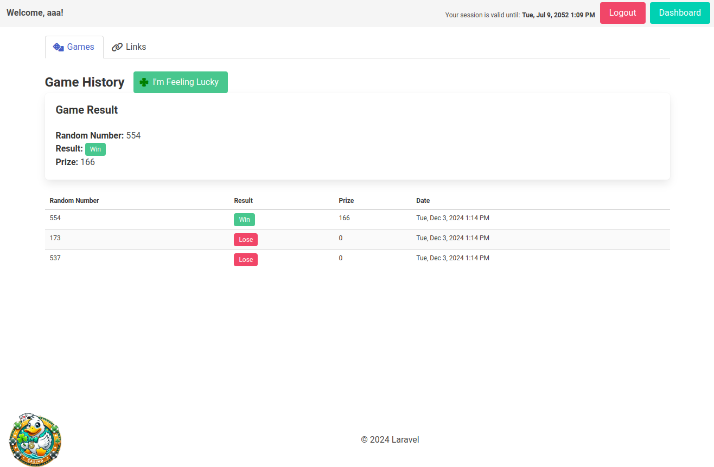

# Casino Lucky Duck


## How to run

In the first terminal:

```shell
git clone git@github.com:PurrProof/lucky-duck-casino.git
cd lucky-duck-casino/
composer install
cp .env.example .env
php artisan key:generate
./vendor/bin/sail up
```

in the second terminal:

```shell
./vendor/bin/sail npm install
./vendor/bin/sail npm run build
./vendor/bin/sail artisan migrate # answer yes
```

## Screenshots




